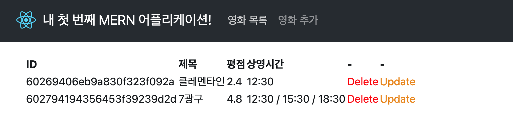
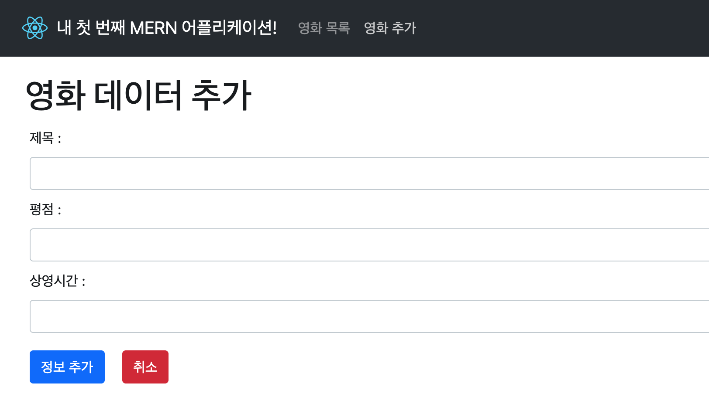

[medium 블로그](https://medium.com/swlh/how-to-create-your-first-mern-mongodb-express-js-react-js-and-node-js-stack-7e8b20463e66) 포스팅을 따라가며 제작한 영화 정보 관리 어플리케이션입니다.

클래스 컴포넌트로 작성된 코드를 함수 컴포넌트로 재작업하였으며, 일부 구버전 디펜던시를 업데이트된 버전에 맞게 다시 작업하였습니다.

### 새롭게 배운 내용

- `axios.create()` 를 통해 axios를 객체로 활용하기
- 백엔드 로직을 작성할 때 controller 폴더를 만들고 rest 로직을 컨트롤러에 작성하기
- 부트스트랩을 활용해 쉽고 빠르게 컴포넌트 꾸미기
- styled-component 를 쓸때 `styled.div.attrs({className: 'movies'})` 처럼 클래스명이나 다른 속성까지 설정할 수 있다는 점

### 더 알아볼 내용 & 다짐

- axios 사용법 구체적으로 정리하기
- 프론트엔드는 결국 백엔드에서 받아온 json을 처리하는 작업! -> 앞으로는 json-server 등으로 목업 백엔드 함께 작업하기 (로컬 투두앱은 이제 그만)
- 머터리얼 UI든 부트스트랩이든 UI 디자인 라이브러리 하나 숙달하기
